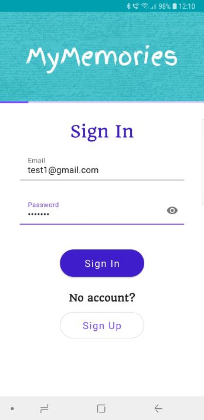
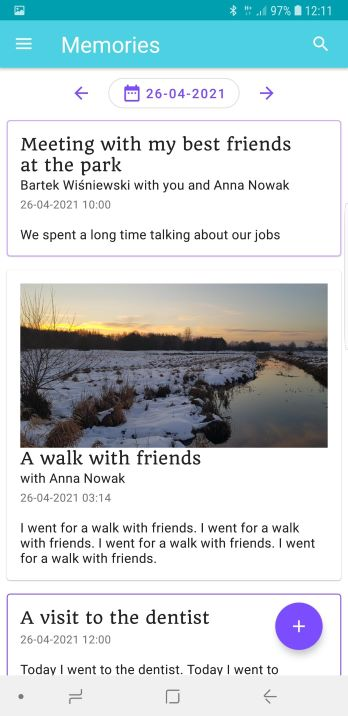
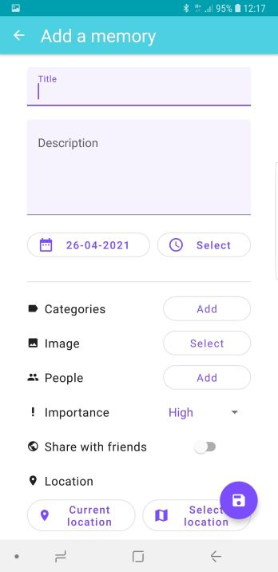
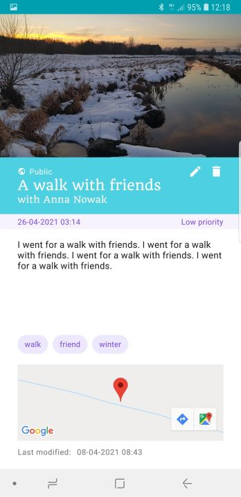
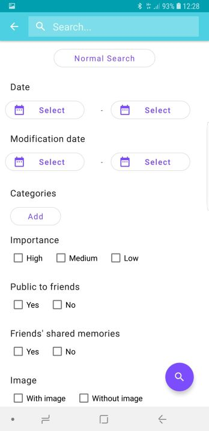
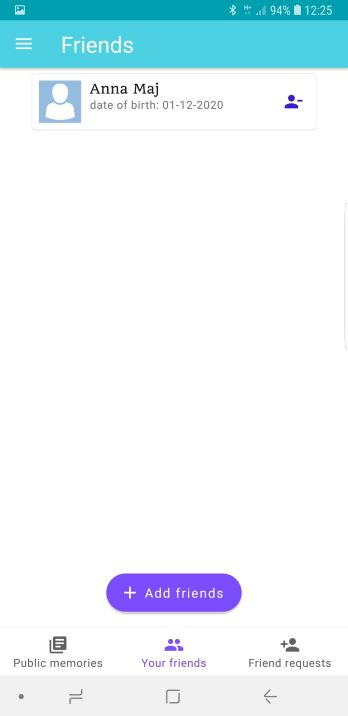
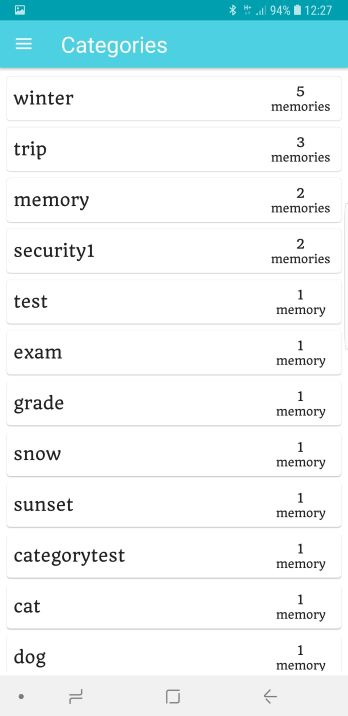
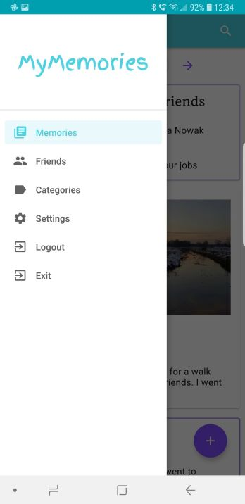

# MyMemories
The aim of this project was to create a mobile system for keeping a personal journal. This project is divided into two parts: mobile application and server. The most important functionalities of this system are adding entries with photos, categories or location. The social element is the friends system and publishing entries or tagging friends.

## Screenshots

## Technologies
* Java
* Android SDK
* Spring Boot
* Spring Security
* JSON Web Token
* Java Persistance API
* MySQL
* Firebase Storage

## Features
* Material Design
* Server security
* Login and registration
* List of memories
* Create, read, update and remove memory
* Add images to memory
* Add location to memory
* Add category to memory
* Basic and advanced search
* Friends system
* Publish memories and tag friends
* Account settings

To-do list:
* Progress indicator where needed while fetching data from server
* Renaming categories
* Checking if AsyncTask is already running when clicking a button repeatedly (for example while adding memory)
* Change the color in the mobile application
* Lock screen rotation
* Minimize the number of server-side functions
* Improve data validation in forms

## Status
Project is _in progress_
